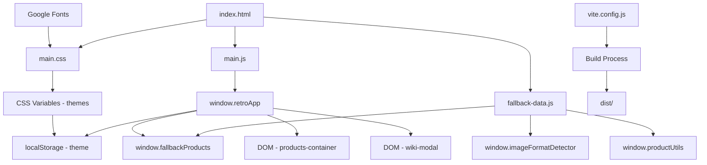

# 🗺️ ГРАФОВАЯ СТРУКТУРА ПРОЕКТА RETRO-PC STORE v3.3.0

**Дата создания:** 14 октября 2025  
**Цель:** Детальное понимание архитектуры для безопасного рефакторинга

---

## 📊 ОБЩАЯ АРХИТЕКТУРА

```
┌─────────────────────────────────────────────────────────────────┐
│                    RETRO-PC STORE v3.3.0                        │
│              Статический одностраничный сайт (SPA)              │
└─────────────────────────────────────────────────────────────────┘
                                │
                ┌───────────────┴───────────────┐
                │                               │
        ┌───────▼────────┐             ┌────────▼─────────┐
        │   FRONTEND     │             │   BUILD TOOLS    │
        │   (Runtime)    │             │  (Development)   │
        └───────┬────────┘             └────────┬─────────┘
                │                               │
    ┌───────────┼───────────┐          ┌────────┼─────────┐
    │           │           │          │        │         │
┌───▼───┐  ┌───▼───┐  ┌───▼───┐  ┌───▼───┐ ┌─▼────┐ ┌─▼────┐
│ HTML  │  │  CSS  │  │  JS   │  │ Vite  │ │ PWA  │ │ Sass │
│ Layer │  │ Layer │  │ Layer │  │       │ │Plugin│ │      │
└───────┘  └───────┘  └───────┘  └───────┘ └──────┘ └──────┘
```

---

## 🏗️ БЛОК 1: HTML СТРУКТУРА (index.html)

### 📋 Назначение
Семантическая разметка страницы с поддержкой PWA, SEO и доступности

### 🔗 Ключевые зоны

```
index.html
│
├── <head> - Метаданные и настройки
│   ├── Meta теги (viewport, charset, description)
│   ├── Open Graph / Social Media теги
│   ├── PWA манифест (manifest.json)
│   ├── Иконки и favicon
│   ├── Preconnect для Google Fonts
│   ├── CSS подключение (assets/css/main.css)
│   └── Structured Data (JSON-LD для SEO)
│
├── <body class="production">
│   │
│   ├── Skip Link (accessibility)
│   │
│   ├── <header class="main-header"> - Шапка сайта
│   │   ├── <h1> - RETRO-PC STORE
│   │   ├── <p> - Подзаголовок
│   │   └── <nav class="main-nav">
│   │       ├── [ТОВАРЫ] - Якорь к #products
│   │       ├── [ВИКИ] - Кнопка модалки Wiki
│   │       └── [ТЕМА] - Переключатель темы
│   │
│   ├── <main id="main-content"> - Основной контент
│   │   └── <section id="products">
│   │       ├── <h2> - Заголовок каталога
│   │       └── <div id="products-container">
│   │           └── Генерируется JS (main.js)
│   │
│   ├── <footer class="site-footer"> - Подвал
│   │   ├── Копирайт и ссылки
│   │   ├── Версия приложения
│   │   └── Статус системы (кнопка)
│   │
│   └── <div id="wiki-modal"> - Модальное окно Wiki
│       ├── .modal-header (заголовок + кнопка закрытия)
│       └── .modal-body (контент Wiki)
│
└── <script> - Подключение JavaScript
    ├── assets/js/main.js
    ├── assets/js/fallback-data.js
    └── Service Worker регистрация (закомментирован)
```

### ⚡ Зависимости
- **CSS:** `assets/css/main.css` (обязательно)
- **JS:** `assets/js/main.js` (обязательно)
- **JS:** `assets/js/fallback-data.js` (обязательно)
- **Внешние:** Google Fonts (VT323, Press Start 2P)

### 🎯 Точки интеграции
- `window.retroApp.init()` - инициализация после загрузки DOM
- `window.showWiki()` - открытие модалки
- `window.hideWiki()` - закрытие модалки

---

## 🎨 БЛОК 2: CSS АРХИТЕКТУРА

### 📁 Файловая структура

```
assets/css/
│
├── main.css ⭐ ГЛАВНЫЙ ФАЙЛ
│   ├── CSS переменные (темы)
│   ├── Базовые стили
│   ├── Layout компоненты
│   ├── Модальные окна
│   ├── Footer
│   ├── Товары (products)
│   ├── Accessibility
│   ├── Responsive дизайн
│   └── Performance оптимизации
│
├── critical.css (критичные стили для первого рендера)
└── style.css (устаревший, возможно дубликат)
```

### 🎭 Система тем

```css
/* ЗЕЛЕНАЯ ТЕМА (по умолчанию) */
:root[data-theme="green"], :root {
    --terminal-bg: #0D0D0D;
    --terminal-primary: #33FF33;
    --terminal-secondary: #00FF00;
    --terminal-dim: #00AA00;
    --terminal-glow: rgba(51, 255, 51, 0.5);
}

/* ЯНТАРНАЯ ТЕМА */
:root[data-theme="amber"] {
    --terminal-bg: #0D0D0D;
    --terminal-primary: #FFB000;
    --terminal-secondary: #FFA500;
    --terminal-dim: #CC8800;
    --terminal-glow: rgba(255, 176, 0, 0.5);
}
```

### 📐 Fluid Design System

```css
/* Адаптивная типографика */
--font-size-base: clamp(1rem, 2.5vw, 1.125rem);  /* 16px → 18px */
--font-size-lg: clamp(1.25rem, 3.5vw, 1.5rem);   /* 20px → 24px */

/* Адаптивные отступы */
--spacing-sm: clamp(0.5rem, 2vw, 1rem);    /* 8px → 16px */
--spacing-md: clamp(1rem, 3vw, 1.5rem);    /* 16px → 24px */
--spacing-lg: clamp(1.5rem, 4vw, 2.5rem);  /* 24px → 40px */

/* Touch targets */
--touch-target-min: 44px;
```

### 📱 Брейкпоинты

```css
@media (max-width: 480px)  { /* Телефоны */ }
@media (max-width: 768px)  { /* Планшеты (portrait) */ }
@media (max-width: 1024px) { /* Планшеты (landscape) */ }
@media (min-width: 1440px) { /* Большие экраны */ }
```

### 🔗 Зависимости
- **Переменные темы:** Управляются JS (`theme-manager.js` в будущем)
- **Google Fonts:** VT323, Press Start 2P
- **HTML классы:** `.production`, `[data-theme]`

---

## 💻 БЛОК 3: JAVASCRIPT АРХИТЕКТУРА

### 🎯 Главный модуль: `main.js`

```javascript
window.retroApp = {
    // СОСТОЯНИЕ ПРИЛОЖЕНИЯ
    version: '3.3.0',
    mode: 'static',
    initialized: false,
    products: [],
    
    // МЕТОДЫ ЖИЗНЕННОГО ЦИКЛА
    init() { ... },                      // Инициализация
    
    // РАБОТА С ДАННЫМИ
    loadDemoProducts() { ... },          // Загрузка товаров
    loadInlineDemoProducts() { ... },    // Резервные данные
    
    // РЕНДЕРИНГ
    renderProducts(products) { ... },    // Отрисовка каталога
    createProductCard(product) { ... },  // Создание карточки товара
    formatSpecKey(key) { ... },          // Форматирование ключей
    
    // ИНТЕРАКТИВНОСТЬ
    viewProduct(productId) { ... },      // Просмотр товара
    
    // УПРАВЛЕНИЕ ТЕМАМИ
    setupThemeToggle() { ... },          // Настройка переключателя
    setTheme(theme) { ... },             // Установка темы
    
    // МОДАЛЬНЫЕ ОКНА
    setupWikiModal() { ... },            // Настройка Wiki
    showWiki() { ... },                  // Показать Wiki
    hideWiki() { ... },                  // Скрыть Wiki
    
    // СОБЫТИЯ
    setupEventListeners() { ... },      // Обработчики событий
    
    // УТИЛИТЫ
    getAppStatus() { ... }               // Статус приложения
};
```

### 📦 Модуль данных: `fallback-data.js`

```javascript
// ДАННЫЕ ТОВАРОВ
window.fallbackProducts = [ ... ];  // 12 товаров

// УТИЛИТЫ ДЛЯ ИЗОБРАЖЕНИЙ
window.imageFormatDetector = {
    supportCache: Map,
    testImages: { avif, webp, jxl },
    
    initializeDetection() { ... },
    testFormat(format) { ... },
    isSupported(format) { ... },
    getBestFormat(imageObject) { ... },
    generatePictureElement() { ... },
    generatePlaceholder() { ... }
};

// УТИЛИТЫ ДЛЯ ТОВАРОВ
window.productUtils = {
    getRandomProducts(count) { ... },
    filterByCategory(category) { ... },
    searchProducts(query) { ... },
    getProductById(id) { ... },
    generateProductSchema(product) { ... }
};

// УТИЛИТЫ ДЛЯ ИЗОБРАЖЕНИЙ
window.imageUtils = {
    loadOptimizedImage(product) { ... },
    trackImageLoad() { ... },
    getImageLoadStats() { ... }
};
```

### 🔄 Поток выполнения

```
1. DOM загружен
   ↓
2. window.retroApp.init()
   ↓
3. loadDemoProducts()
   ├─→ Проверка window.fallbackProducts
   ├─→ Если есть → renderProducts()
   └─→ Если нет → loadInlineDemoProducts()
   ↓
4. setupThemeToggle()
   ├─→ Загрузка сохраненной темы из localStorage
   └─→ Установка обработчика клика
   ↓
5. setupWikiModal()
   ├─→ Настройка закрытия по клику вне модалки
   └─→ Настройка закрытия по ESC
   ↓
6. setupEventListeners()
   └─→ Skip link, другие обработчики
   ↓
7. initialized = true
```

### 🎨 Рендеринг товаров

```
renderProducts(products)
   ↓
   Для каждого товара:
   ├─→ createProductCard(product)
   │   ├─→ Получить URL изображения
   │   ├─→ Сформировать спецификации
   │   ├─→ Создать HTML карточки
   │   └─→ Вернуть HTML строку
   │
   └─→ Вставить все карточки в #products-container
```

### 🔗 Глобальные функции

```javascript
// Экспортированные для использования в HTML
window.showWiki()
window.hideWiki()
window.retroApp.viewProduct(id)
window.retroApp.getAppStatus()
```

---

## 🛠️ БЛОК 4: BUILD TOOLS (Vite)

### 📋 Конфигурация: `vite.config.js`

```javascript
{
    base: '/RETRO-PC-STORE/',  // GitHub Pages путь
    
    server: {
        port: 3000,
        open: true,
        host: true
    },
    
    build: {
        outDir: 'dist',
        minify: 'terser',       // Минификация
        sourcemap: false,        // Без source maps
        terserOptions: {
            compress: {
                drop_console: true,  // Убрать console.log
                drop_debugger: true
            }
        },
        rollupOptions: {
            output: {
                manualChunks: {
                    'vendor': ['workbox-window'],
                    'fallback-data': ['./assets/js/fallback-data.js']
                }
            }
        }
    },
    
    plugins: [
        VitePWA({ ... }),      // PWA поддержка
        legacy({ ... }),        // Старые браузеры
        viteCompression({ ... }) // Gzip + Brotli
    ]
}
```

### 🔧 NPM Scripts

```json
{
    "dev": "vite",              // Запуск dev-сервера
    "build": "vite build",      // Production сборка
    "preview": "vite preview",  // Предпросмотр сборки
    "lint": "eslint ..."        // Линтинг кода
}
```

---

## 📱 БЛОК 5: PWA (Service Worker)

### 📋 Конфигурация: `sw.js`

```javascript
CACHE_VERSION = 'retro-pc-store-v3.2.0';

// ТИПЫ КЕШЕЙ
CACHE_NAME       // Основной кеш
FALLBACK_CACHE   // Offline страницы
DYNAMIC_CACHE    // Динамический контент
API_CACHE        // API ответы

// СТРАТЕГИИ КЕШИРОВАНИЯ
CacheFirst           // Статика (CSS, JS, изображения)
NetworkFirst         // HTML страницы
StaleWhileRevalidate // API запросы

// КЛАССЫ
ServiceWorkerLogger      // Логирование
CacheManager            // Управление кешем
NetworkStrategies       // Сетевые стратегии
BackgroundSyncManager   // Фоновая синхронизация
PushNotificationManager // Push уведомления
```

### 🔄 События Service Worker

```
install → Кеширование критичных ресурсов
   ↓
activate → Очистка старых кешей
   ↓
fetch → Перехват запросов + применение стратегий
   ↓
sync → Фоновая синхронизация (опционально)
   ↓
push → Push уведомления (опционально)
```

### ⚠️ Текущий статус
**ЗАКОММЕНТИРОВАН** в `index.html` - не активен

---

## 📊 БЛОК 6: ДАННЫЕ И КОНТЕНТ

### 🗂️ Структура товара

```javascript
{
    id: "intel-8086-vintage",
    title: "Intel 8086 CPU - Vintage 16-bit Processor (1978)",
    currentPrice: "$89.99",
    condition: "Used - Excellent",
    location: "Silicon Valley, CA",
    brand: "Intel",
    yearManufactured: "1978",
    
    images: {
        avif: "/assets/img/fallback/intel-8086.avif",
        webp: "/assets/img/fallback/intel-8086.webp",
        jpg: "/assets/img/Intel_8086-2.jpg",
        alt: "Описание для accessibility"
    },
    
    seoMetadata: {
        description: "...",
        keywords: [...],
        category: "Vintage Processors"
    },
    
    specifications: {
        architecture: "x86 16-bit",
        frequency: "5-10 MHz",
        transistors: "29,000",
        ...
    }
}
```

### 📈 Количество товаров
- **Всего:** 12 товаров
- **Категории:** Процессоры, Графика, Звук, Память, Периферия

---

## 🎯 БЛОК 7: ИНТЕРАКТИВНОСТЬ

### 🔄 Потоки взаимодействия

#### 1️⃣ Загрузка страницы
```
Пользователь открывает index.html
   ↓
Загружается HTML
   ↓
Параллельно: CSS + JavaScript
   ↓
DOMContentLoaded
   ↓
retroApp.init()
   ↓
Загрузка товаров из fallback-data.js
   ↓
Рендеринг каталога
   ↓
Настройка темы из localStorage
   ↓
Страница готова
```

#### 2️⃣ Переключение темы
```
Клик на [ТЕМА]
   ↓
retroApp.setTheme(newTheme)
   ↓
document.documentElement.setAttribute('data-theme', theme)
   ↓
localStorage.setItem('retro-theme', theme)
   ↓
CSS переменные автоматически обновляются
   ↓
Визуальная смена темы (0.3s transition)
```

#### 3️⃣ Просмотр товара
```
Клик на [ПРОСМОТР ДЕТАЛЬНО]
   ↓
onclick="window.retroApp.viewProduct('intel-8086')"
   ↓
Поиск товара в products массиве
   ↓
Формирование детальной информации
   ↓
alert() с информацией (временное решение)
```

#### 4️⃣ Открытие Wiki
```
Клик на [ВИКИ]
   ↓
onclick="showWiki()"
   ↓
modal.setAttribute('aria-hidden', 'false')
   ↓
modal.style.display = 'flex'
   ↓
document.body.style.overflow = 'hidden'
```

---

## 🔍 БЛОК 8: ЗАВИСИМОСТИ

### 📦 Внешние зависимости

```
Google Fonts
├── VT323 (монопространственный шрифт)
└── Press Start 2P (пиксельный шрифт)
```

### 📚 NPM зависимости

```json
{
    "devDependencies": {
        "vite": "^5.0.0",
        "vite-plugin-pwa": "^0.17.0",
        "sass": "^1.69.0",
        "@vitejs/plugin-legacy": "^5.0.0",
        "vite-plugin-imagemin": "^0.6.1",
        "vite-plugin-compression": "^0.5.1"
    },
    "dependencies": {
        "workbox-window": "^7.0.0"
    }
}
```

### 🔗 Внутренние зависимости

```
index.html
   ↓
   ├─→ assets/css/main.css
   ├─→ assets/js/main.js
   │   └─→ использует window.fallbackProducts
   │
   └─→ assets/js/fallback-data.js
       └─→ экспортирует window.fallbackProducts
                          window.imageFormatDetector
                          window.productUtils
                          window.imageUtils
```

---

## ⚠️ КРИТИЧЕСКИЕ ТОЧКИ

### 🔴 Монолитный main.js
**Проблема:** Вся логика в одном файле (~500 строк)  
**Риск:** Сложно поддерживать, тестировать  
**Решение:** Разбить на модули

### 🔴 Дублирование CSS
**Проблема:** main.css, style.css, critical.css  
**Риск:** Конфликты, избыточность  
**Решение:** Объединить в модульную SCSS структуру

### 🔴 Закомментированный Service Worker
**Проблема:** PWA не активен  
**Риск:** Нет offline режима  
**Решение:** Раскомментировать и протестировать

### 🔴 Данные захардкожены
**Проблема:** Товары в JS файле  
**Риск:** Сложно редактировать  
**Решение:** Вынести в JSON

### 🔴 Только JPG изображения
**Проблема:** Старый формат  
**Риск:** Большой размер файлов  
**Решение:** Конвертировать в WebP/AVIF

---

## 🎯 КАРТА РЕФАКТОРИНГА

### Этап 1: Модуляризация JavaScript
```
main.js
   ↓
   ├── app.js (главный файл)
   ├── modules/
   │   ├── theme-manager.js
   │   ├── product-renderer.js
   │   ├── modal-manager.js
   │   ├── data-loader.js
   │   └── utils.js
   └── data/
       └── products.json
```

### Этап 2: Модуляризация CSS
```
main.css
   ↓
   ├── main.scss
   ├── _variables.scss
   ├── _base.scss
   ├── _layout.scss
   ├── components/
   │   ├── _product-card.scss
   │   ├── _modal.scss
   │   └── _navigation.scss
   └── sections/
       ├── _header.scss
       ├── _footer.scss
       └── _products.scss
```

### Этап 3: Оптимизация ресурсов
```
assets/img/
   ↓
   ├── intel-8086.avif (новый)
   ├── intel-8086.webp (новый)
   └── intel-8086.jpg (существующий)
```

### Этап 4: Активация PWA
```
index.html (раскомментировать SW)
   ↓
sw.js (настроить кеширование)
   ↓
Тестирование offline режима
```

---

## 📈 МЕТРИКИ УСПЕХА

### Производительность
- ✅ **Lighthouse:** 95+ → Цель: 100
- ✅ **LCP:** < 1.2s → Цель: < 1.0s
- ✅ **Bundle size:** ~150KB → Цель: < 50KB (gzipped)

### Качество кода
- ⚠️ **Модульность:** Монолит → ES6 модули
- ⚠️ **Тестируемость:** 0% → 80%+
- ⚠️ **Документация:** Частичная → Полная

### Функциональность
- ❌ **Поиск:** Нет → Instant search
- ❌ **Фильтрация:** Нет → По категориям
- ⚠️ **PWA:** Закомментирован → Активен

---

## 🗺️ ГРАФ ЗАВИСИМОСТЕЙ



---

## ✅ ГОТОВНОСТЬ К РЕФАКТОРИНГУ

### Понимание архитектуры: ✅ 100%
- Все файлы изучены
- Все зависимости картированы
- Все потоки данных понятны

### Документация: ✅ Создана
- Графовая структура
- Блочная архитектура
- Критические точки выявлены

### План действий: ✅ Готов
- Поэтапная модернизация
- Безопасный рефакторинг
- Тестирование на каждом этапе

---

**🎯 Проект полностью проанализирован и готов к качественному рефакторингу без поломок!**
